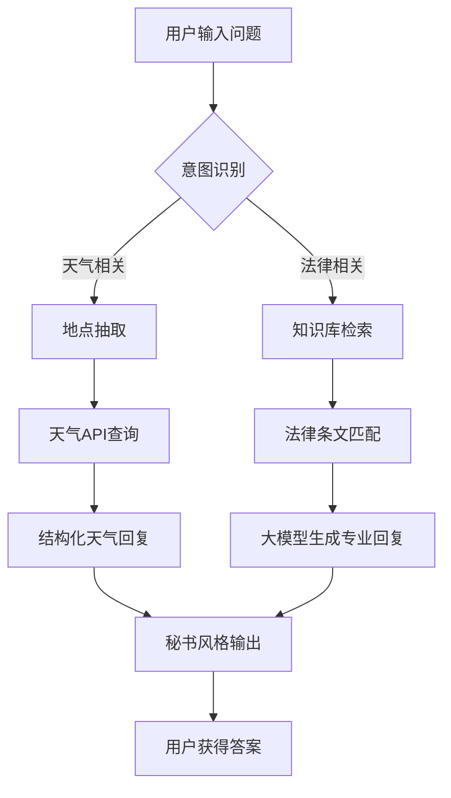

# 多功能秘书助手系统（法律+天气）

本项目是一个基于 Qwen3-0.6B 大模型的智能秘书助手（Agent），集成了法律咨询（专精劳动法）和天气查询服务，支持自然语言交互、知识库检索和多工具调用。

---

## 主要技术框架

| 技术 | 用途 | 版本/备注 |
|------|------|-----------|
| Python | 主开发语言 | 3.10+ |
| PyTorch | 深度学习框架 | 与Transformers配合使用 |
| LangChain | 文档处理框架 | 提供文本分块和向量化工具 |
| Transformers | NLP模型库 | 4.30+ |
| Requests | HTTP请求库 | API调用 |
| FAISS | 向量数据库 | Facebook开源 |
| HuggingFace | 模型托管 | 嵌入模型下载 |

---

## 项目流程图



---

## 项目结构

```
Agent/
├── main.py                      # 项目主入口，秘书助手核心逻辑
├── config.py                    # 配置文件（如API密钥等）
├── prompt_templates.py          # 统一提示词模板
├── location_extractor.py        # 地点抽取工具
├── api_integration/             # 外部API集成
│   ├── legal_case_api.py        # 法律案例API
│   ├── weather_api.py           # 天气查询API
├── my_knowledge_base/           # 知识库相关模块
│   ├── file_processor.py        # 文档预处理
│   ├── text_chunker.py          # 文本分块
│   ├── vector_db.py             # 向量数据库管理
│   ├── inspect_vector_db.py     # 向量数据库检查
│   ├── parsed_document/         # 预处理结果
│   ├── chunk_output/            # 分块结果
│   └── vector_db/               # 向量数据库文件
├── embedding_model/             # 嵌入模型存储
│   └── all-MiniLM-L6-v2/        # HuggingFace sentence-transformer模型
├── Qwen3-0.6B/                  # 大语言模型相关文件
├── data/                        # 数据文件（如城市名单）
│   └── chinese_cities.txt
├── tests/                       # 单元测试与脚本
├── requirements.txt             # 依赖包列表
├── README.md                    # 项目说明文档
```

---

## 项目演示

**天气查询示例：**

>请输入您的问题: 小雅 你知道今天天气怎么样呢

【东莞天气查询结果】
你好！今天天气怎么样呢？😊
根据最新的预报，今天（2025-07-25）是雷阵雨，白天和夜间温度在27-35℃之间，天气有点阵雨，但整体比较舒适 。建议你带伞出门，注意防雨哦！  
明天（2025-07-26）是多云，白天和夜间温度27-36℃，天气比较晴朗，适合户外活动。  
后天（2025-07-27）是雷阵雨，白天和夜间温度26-34℃，虽然天气有点变化，但整体还是适合外出的。  
天气变化要注意，记得关注实时天气，这样我们才能更好地安排生活和出行哦！  
有什么其他问题吗？我随时在这里～(*^▽^*)

>请输入您的问题: 我想去广州旅游 明天会下雨吗

【广州天气查询结果】
当然可以啦！广州天气预报显示，明天（2025-07-26）白天多云，夜间有雷阵雨，气温在26℃至35℃之间。不过，雷 阵雨可能会带来短暂的降雨，建议您出门前留意一下天气预报，如果需要出行，可以提前备好雨具，这样既安全又 方便。
如果您还有其他关于广州旅游或法律咨询的问题，随时告诉我哦！😊

---

**法律咨询示例：**

> 请输入您的问题: 用人单位濒临破产进行法定整顿期间或者生产经营状况发生严重困难，可以进行裁员吗？这样裁 减的人员，后面是不是要优先录用呢？                                                                   
                                                                            
【检索到的法律条文】
[条文 1]: 中华人民共和国劳动法
第三章 劳动合同和集体合同
第二十七条 用人单位濒临破产进行法定整顿期间或者生产经营状况发生严重困难，确需裁减人员的，应当提前三十日向工会或者全体职工说明情况，听取工会或者职工的意见，经向劳动行政部门报告后，可以裁减人员。 用人单位依据本条规定裁减人员，在六个月内录用人员的，应当优先录用被裁减的人员。
[条文 2]: 中华人民共和国劳动法
第六章 劳动安全卫生
第五十二条 用人单位必须建立、健全劳动安全卫生制度，严格执行国家劳动安全卫生规程和标准，对劳动者进行劳动安全卫生教育，防止劳动过程中的事故，减少职业危害。


【法律咨询结果】
亲爱的用户，你好呀～😊
您提到的问题挺有现实意义的，我来帮您理清楚。首先，您提到的“用人单位濒临破产进行法定整顿期间或者生产经营状况发生严重困难，可以进行裁员吗？”这个问题，我来详细解释一下：
根据《中华人民共和国劳动法》第三章第二十七条的规定，如果用人单位在濒临破产、濒临解散或者生产经营状况 发生严重困难的情况下，确实需要裁员，可以提前三十日向工会或者全体职工说明情况，听取意见，经向劳动行政 部门报告后，可以裁减人员。而且，如果在六个月内

再录用人员，也应当优先录用被裁减的人员。这说明，裁员是有法律依据的，而且优先录用是强制性的，这是为了保障劳动者权益。

至于您提到的“后面是不是要优先录用呢？”这个问题，我来确认一下：是的，根据法律规定，优先录用是必须的， 这是为了维护劳动关系的稳定和劳动者的基本权益。

不过，如果您还有其他问题，比如关于劳动安全卫生、天气情况，我随时可以帮您解答哦！有什么您想了解的，可 以告诉我，我也会用温暖专业的语气为您服务～(*^▽^*)

---

## 快速开始

1. 安装 Python 3.10+，建议使用虚拟环境。
2. 安装依赖：
   ```
   pip install -r requirements.txt
   ```
3. 下载并放置 Qwen3-0.6B 模型于 `Qwen3-0.6B/` 目录。
4. 下载 HuggingFace `all-MiniLM-L6-v2` 嵌入模型于 `embedding_model/all-MiniLM-L6-v2/`。
5. 配置 `data/chinese_cities.txt` 城市名单。
6. 在 `config.py` 中填写心知天气等API密钥。
7. 运行主程序：
   ```
   python main.py
   ```

---

## License

本项目仅供学习与研究使用，禁止商用